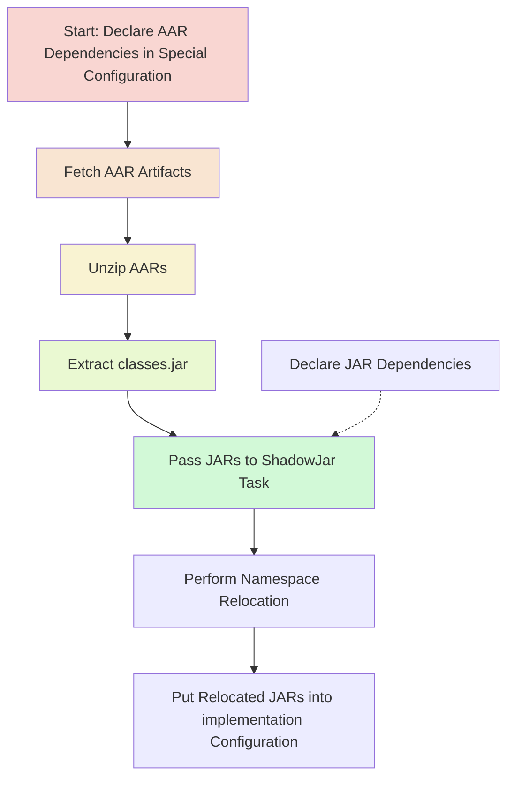

# Motivation

The [Gradle Shadow Plugin](https://github.com/johnrengelman/shadow) is a very useful plugin for allowing Java library authors to relocate packages from their original namespace to a new package namespace to avoid collisions between a library’s dependencies and a host application’s dependencies. Android library authors face the same concerns as Java library authors. However, the Gradle Shadow Plugin does not work out of the box for Android Artifacts (AARs) - the artifact format of Android Libraries - as the Gradle Shadow Plugin is only designed to work with Java Artifacts (JARs) out of the box. This repo defines an example Gradle Plugin called the `ShadowAarDependenciesPlugin` that provides Android library authors with an easy way for declaring Android Artifact dependencies in need of namespace relocations.

# Getting started

### Step 1

In your `app/build.gradle.kts`, make sure to import the `ShadowAarDependenciesPlugin` plugin and the `ShadowAarDependenciesPluginExtension` extension. 

```kotlin

import com.example.ShadowAarDependenciesPlugin
import com.example.ShadowAarDependenciesPluginExtension
```

### Step 2

You’ll then need apply the `ShadowAarDependenciesPlugin` plugin

```kotlin
apply<ShadowAarDependenciesPlugin>()
```

### Step 3

Next, declare all of the package namespace relocations you are looking to perform in the extension

```kotlin
extensions.getByType(ShadowAarDependenciesPluginExtension::class.java).apply {
    relocations.set(mutableListOf(
        listOf("com.original.namespaceA", "com.new.namespaceA"),
        listOf("com.original.namespaceB", "com.new.namespaceB"),
    ))
}
```

### Step 4

Finally, declare all of the Android Artifact dependencies that require namespace relocation in the `aarImplementation` configuration. The `aarImplementation` configuration will put the relocated packages on both the compile time classpath and the runtime classpath.

```kotlin
dependencies {
    add("aarImplementation", "com.datadoghq:dd-sdk-android-logs:2.2.0")
}
```

# How does it work?

As we’ve already established, The Gradle Shadow Plugin operates out of the box on Java Artifacts (JARs) and is not capable of operating on Android Artifacts (AARs). However, Android Artifacts are typically just zip files that contain a `classes.jar`, which is the library’s compiled JVM code. This plugin bridges the gap by creating a special Gradle configuration for declaring AAR dependencies (there’s no need to do this for JAR libraries as you can just use the Gradle Shadow Plugin’s `ShadowJar` task directly), fetches the AAR artifacts from the remote repository, unzips the AARs, extracts the `classes.jar`, passes these extracted JARs to a ShadowJar task to perform namespace relocation, and finally puts these relocated JARs back into the standard `implementation` configuration.


